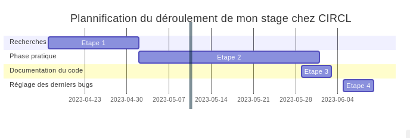

title: Rapport intermédiaire
author: BOUBRIMA Rawane
date: 10 mai 2023
---

# Introduction

Du 17 avril au 9 juin 2023 (8 semaines), j'ai pour objectif d'effectuer mon stage au sein de l'entreprise CIRCL, située au 122 Rue Adolphe Fischer, 1521 Gare Luxembourg. Pendant ce stage dans le domaine de l'informatique, plus précisément dans celui orienté résau, j'ai été impliqué dans un grand projet d'envergure internationale qui est MISP.
CIRCL est une entreprise spécialisée dans la sécurité informatique et est une organisation récemment créée en 2012, qui a su faire les bons choix pour se faire un nom et une place en tant qu'acteur majeur de la sécurité informatique au Luxembourg. Elle n'est pas simplement reconnue au niveau national mais aussi internationalement grâce à ses projets, son engagement et son efficacité. 
Avec Alexandre Dulaunoy en tant que tuteur, j'ai bénéficié des meilleures explications et de l'accompagnement nécessaire pour le bon déroulement de ce début de stage.

Cela fait un mois que nous avons commencé notre stage obligatoire de deux mois en entreprise, dans le cadre de notre deuxième année de formation de Bachelor Universitaire de Technologie. Cette expérience est, à mon sens, essentielle lors de notre cursus scolaire, car elle nous permet d'expérimenter le monde du travail dans le domaine que nous avons choisi d'étudier.
En tant que promotion ayant suivi la filière générale ou technologique au lycée, contrairement à la filière professionnelle, nous n'avons pas eu l'occasion d'acquérir une expérience professionnelle en lien direct avec nos études. Cette expérience est donc extrêmement importante et enrichissante pour nous, car elle représente notre première véritable expérience professionnelle. De plus, l'ajout d'un sujet à accomplir au cours de cette période rend l'expérience d'autant plus intéressante.
Mon objectif à l'issue de mon stage est de mener à bien le sujet que j'ai choisi, qui a pour but d'améliorer la virtualisation et l'orchestration de l'infrastructure de formation. Cela implique la mise à jour de plusieurs fichiers datant maintenant de plusieurs années, tout en prenant en compte que la modification de ces fichiers peut engendrer d'autres erreurs ailleurs. Il s'agit donc d'un travail pointilleux et assez complexe à réaliser.
Le sujet a été proposé par l'organisme d'accueil, afin de pouvoir nous aider dans le cas où nous rencontrerions des problèmes, car la plupart des entreprises dans lesquelles les étudiants effectuent leur stage possèdent un service informatique, voire une personne ayant des connaissances en informatique. Étant donné que le sujet est proposé par l'entreprise, il peut nécessiter l'utilisation d'outils que nous n'avons pas spécialement utilisés lors de nos cours, mais dont nous aurons besoin. L'attribution du sujet par l'entreprise est donc essentielle au bon déroulement de cette expérience.

Néanmoins, le choix de ce stage et plus précisément de ce sujet de stage est une réelle opportunité pour moi, ayant pour réelle ambition de m'orienter dans un domaine qui m'intéresse énormément qui n'est autre que la cybersécurité. Travailler avec des personnes qui pratiquent un métier dans cette spécialité de l'informatique est réellement enthousiasmant et faire un projet directement lié à mon choix d'étude future l'est encore plus.

Afin de vous expliquer au mieux ce début de stage dans une entreprise informatique, je vais vous présenter en détail tout ce que j'ai fait depuis mon arrivée en vous exposant tout d'abord l'intitulé de mon sujet, les outils utilisés, puis je vais entrer dans le vif du sujet en montrant ce que j'ai fait en divisant cette grande partie en trois parties distinctes : l'une portant sur les recherches et l'autre sur les manipulations que j'ai réalisées et la dernière sur mon avancée. Enfin, je conclurai brièvement en donnant mon avis sur mon stage.

# Sujet de stage 

Afin de mener à bien l'explication détaillée de mon projet, je vais tout d'abord vous présenter l'intitulé de mon stage ainsi que ce qui m'a été initialement demandé lors de la préparation de celui-ci.
Je vais ensuite poursuivre en vous présentant les outils qui m'ont été mis à disposition ainsi que les logiciels que l'on m'a demandé d'utiliser afin de mener à terme mon projet.
Enfin, je finirais en vous présentant ce que j'ai pu faire durant ce premier mois et ce qu'il me reste à accomplir.

## Intitulé du sujet de stage 

L'intitulé du sujet de stage est le suivant : "MSc Student Internship Position - Improvement of Virtualisation and Orchestration of Training Infrastructure",ce qui se traduit par "Poste de stage pour
étudiant(e) en master - Amélioration de la virtualisation et de l'orchestration de l'infrastructure de formation". Comme vous l'aurez remarqué, le sujet n'est pas réellement adapté à mon niveau
actuel d'études. Cependant, lors de mon choix de sujet de stage, celui-ci semblait se rapprocher le plus de ce que je voulais entreprendre dans mes études futures. Cela pourrait également constituer
un réel défi pour moi, en me poussant à me surpasser et à découvrir davantage de choses.

Pour réussir ce travail, j'ai donc un certain nombre de tâches et de maîtrises à acquérir. Tout d'abord, je dois être en mesure de maîtriser le SCM (Source Control Management) Git. Ensuite, je dois être
en mesure de procéder au déploiement et à l'installation de l'infrastructure threat intel MISP en VM afin de contribuer activement à ce même projet open source. Enfin, je dois acquérir des compétences
en Bash et en Unix scripting.

Ayant eu la chance de manipuler Git lors de mes heures d'enseignement et d'avoir des bases en Bash et en Unix scripting en première année de mon cursus en BUT informatique, je dispose de certaines
compétences sur lesquelles m'appuyer, même si mes compétences en Bash sont encore très limitées.

## Outils et logiciels mis à disposition

Bien évidemment, au vu de mon sujet de stage, je ne serai pas amené à utiliser des switchs ou des routeurs ou ce genre de choses que l'on a pu pratiquer de nombreuses fois en travaux pratiques de réseaux avancés, par exemple, mais à manipuler exclusivement grâce à un ordinateur comme en cours de virtualisation, par exemple. De ce fait, un ordinateur portable sur lequel je travaille sous Ubuntu 22.04 est le seul outil matériel qui m'a été fourni. En termes de logiciel, j'ai été amené à utiliser principalement Vagrant et VirtualBox.
J'ai par ailleurs utilisé d'autres outils suite aux conseils avisés de mon tuteur, tels que HedgeDoc qui me permet de mettre en page chaque jour les tâches accomplies, en donnant la possibilité par la même occasion à mes collègues de voir mon avancée et d'apporter des modifications à ce que j'ai fait. Mais ce n'est en revanche pas le seul outil de collaboration utilisé. On m'a proposé d'utiliser Element afin d'échanger avec chacune des personnes présentes ou avec elles toutes en même temps, afin d'avoir des réponses rapides.
L'ensemble de ces outils va me permettre de modifier le dossier misp-vagrant qui regroupe l'ensemble des fichiers sur lesquels je dois travailler lors de mon projet.

Par conséquent, voici l'ensemble des outils que j'ai dû apprendre à utiliser :

- Vagrant: Vagrant est un outil open source qui a pour but de gérer la création et la configuration de machines virtuelles. Ainsi, il rend possible la configuration, la création et la gestion d'environnements de développement virtuels qui permettent d'exécuter des tâches de développement et de test, de tester des applications et aussi pour toute autre manipulation requérant l'emploi de développement stable et reproductible. C'est un outil nous permettant de créer des machines virtuelles à partir de modèles qui sont préconfigurés et que l'on appelle des box. En bref, il permet aux utilisateurs la création simple et rapide d'un environnement de développement reproductible qui permettrait de réduire par conséquent les erreurs de configuration tout en facilitant le travail collaboratif.

- VirtualBox: Ce logiciel open source de virtualisation de système d'exploitation permet à notre ordinateur de créer et gérer des machines virtuelles, offrant ainsi la possibilité d'exécuter et de tester plusieurs systèmes d'exploitation sur une seule et unique machine physique. L'utilisateur peut donc installer différents systèmes d'exploitation tels que Linux, macOS ou encore Windows. Chacune de ces machines virtuelles possède ses propres ressources et configurations, et aucune d'entre elles n'a accès aux fichiers pouvant être présents sur la machine hôte, ce qui signifie que les tests se font de manière complètement isolée.

- HedgeDoc : Cette application de prise de notes et de collaboration est un projet open source accessible via un navigateur web. Elle permet de faire de multiples choses, telles que la prise de notes seule ou en collaboration simultanée, étant un outil collaboratif. Elle permet également, lors de la prise de notes, la création de tableaux, de listes, de diagrammes de Gantt, d'ajouter des commentaires et bien d'autres fonctionnalités. C'est donc un outil de collaboration en ligne facile à utiliser et offrant de multiples fonctionnalités.

- Element : Element est un outil de communication instantanée permettant à ses utilisateurs de communiquer par appel vidéo, audio et par messagerie, que ce soit individuellement ou en groupe. Il est disponible sur plusieurs systèmes d'exploitation et offre des fonctionnalités avancées en termes de sécurité et de confidentialité.

- misp-vagrant : Misp-vagrant est un environnement de développement virtuel qui a été spécialement pré-configuré pour le système de prévention des incidents de sécurité informatique qu'est MISP. Ainsi, il permet la création et l'installation locale de MISP pour le tester, bien sûr, en utilisant une machine virtuelle basée sur Vagrant, afin que cela n'affecte en rien la machine hôte.

- Langage de programmation Markdown pour rédiger mon rapport intermédiaire de stage.

J'ai bien sûr utilisé d'autres outils que je connaissais, tels que Git ou encore le langage de programmation Bash, dans lesquels j'ai quelques difficultés.

Du fait qu'il n'y a pas beaucoup de nouveaux outils matériels et/ou logiciels, instinctivement, une personne peut penser que l'apprentissage de l'utilisation de ces équipements n'est pas si compliqué, mais c'est uniquement lorsque l'on entre dans le vif du sujet que nous mesurons la difficulté, chose que nous allons analyser directement au point suivant.

## Ce que j'ai fait 

Pour mener à bien mon projet, j'ai décidé de m'imposer dès le début de mon stage une chronologie dans l'élaboration de mon travail. J'ai pu remarquer, lorsque j'étais en plein apprentissage dans mon établissement scolaire, que lorsque nous entamions un nouveau "chapitre", j'avais tendance à me précipiter et ne prenais pas réellement le temps de comprendre correctement les outils que j'allais être amenée à utiliser. Cela me valait de très vite me perdre dans ce que je faisais et de me disperser, et m'amenait la plupart du temps à rester bloquée, et donc à ne plus être aussi productive que je pensais l'être.

C'est pourquoi j'ai pris l'initiative, pour mon stage, de repartir sur des bases solides, sans aucune précipitation. Et pour ce faire, j'ai tout d'abord décidé de me consacrer une période de recherche sur tous les dispositifs que j'allais être amenée à utiliser. Seulement après avoir jugé que j'avais une compréhension assez "complète" de ce que je devais faire et utiliser, je pourrais passer à la phase pratique de la réalisation de ce projet. Je vais ainsi segmenter l'explication du travail que j'ai entrepris durant ce premier mois en 3 grands points. Je vais d'abord vous informer sur les recherches que j'ai entreprises et pourquoi, je vais ensuite vous présenter tout ce que j'ai pu faire lors de la phase pratique dans laquelle je suis actuellement, et je finirai par vous présenter très rapidement où je me situe dans l'avancement de mon projet ainsi que ce que je compte faire pour ce deuxième mois.

### Recherches 

Pour débuter correctement mon stage, j'ai tout d'abord tenu à me documenter un maximum tout d'abors sur les logiciel que je devrais utiliser, à savoir Vagrant et Virtualbox. Ces deux logiciel m'était 
jusqu'au début de mon stage totalement inconnu du fait que je n'ai jamais ,ni lors de mon apprentissage ni lors des projet semestrielle (SAE), été amener à les utiliser ou ne serais-ce à en prendre 
connaissance.J'ai ete amener lors de mes cours de système de sécurité reseaux et de virtualisation à travailler sur des machine virtuelles mais ai remarquer que ce que je faisait et ce que je fait 
actuellement pour mon sujet n'est pas enormement simmilaire, pour cause lorsque je travailler sur machines virtuelles lors de mes cours je travailler tout d'abords sur VMWare et non sur Virtualbox et 
j'avais une interface graphique ce qui n'est ici pas le cas. Pour me documenter correctement j'ai donc décider de tout d'aboord de lire un maximum d'article sur ces duecx logiciel afin d'en savoir le
plus possible, j'ai aussi consulté different forum informatique qui évoquer le sujet et pour vagrant ai biensur lu la "Vagrant Documentation" et j'ai enfin regarder de nombreuses vidéo pour essayer de
perfectionner au mieux mes connaissances.
Pour continuer j'ai entames mes recherches sur le projet MISP car étant dans l'optique a l'issue de mon projet de contribuer à ce grand projet avec la modification du dossier misp-vagrant, j'ai décider
d'en apprendre plus à ce sujet. Pour me document sur ce point j'ai tout d'abord comme énoncer précedement consulter de nombreux articles, ai directement consulté la docuementation MISP et enfin, ai
regarder quelques video sur le sujet, mais contrairement au point précédent j'ai ici aussi pris connaisance du code de ce projet.Bien que le code de projet soit assez colossale il m'a semblais tout de
même necessaiee d'en prendre connaissances afin d'en savoir le plus possible.
Pour poursuivre mes recherches j'ai decider de me pencher sur le bash et Unix scripting afin de m'améliorer dans ce language de programation, j'ai pour ce faire lu plusieurs articles et ai lus 
brievement quelques livre dont "beginning shell scripting" conseillé et fournis par mon tuteur de stage.
Enfin pour finir la partie concernant les recherches effectuer j'ai decider d'analyse de manière détailler l'intitulé de mon sujet en recherchant les mots qui me paraissais "clés" afin d'avoir une
meilleurs compréhension de ce qui m'était demander..

 

### Phase pratique

Après m'être correctement documenté, il est maintenant temps de passer à la manipulation. En ce qui concerne mon sujet, la première étape de ma phase de manipulation est le changement des fichiers de 
code présents dans le dossier misp-vagrant. Conformément aux propos précédents, j'ai commencé par utiliser VirtualBox à l'aide de Vagrant, puis j'ai continué par la modification des fichiers présents 
dans misp-vagrant. Nous entrons maintenant dans le vif du sujet. Comme je vous l'ai expliqué au préalable, MISP est une plateforme de partage de connaissances au sujet des attaques et menaces informatiques.
misp-vagrant fournit une configuration pré-définie pour le déploiement de MISP et contribue à cette communauté en signalant des bugs tout en proposant des améliorations.

Les fichiers auxquels je dois procéder à la modification dans le cadre de mon projet datent aujourd'hui de plusieurs années déjà. L'évolution de ces dernières années n'a fait que s'intensifier, 
particulièrement dans le domaine de l'informatique qui est un univers de connaissances en constante expansion. Avec toutes les avancées que l'on a faites, les nouvelles versions de tous les outils 
utilisés, les fichiers que nous avons actuellement en notre possession présentent un certain nombre d'erreurs. Mon objectif au cours de ces deux mois de stage sera de faire les modifications nécessaires
afin qu'il n'y ait plus d'erreurs, cela implique le changement, par exemple, des versions des outils installés. Si cela consistait simplement à changer les versions installées de différents outils, 
cela irait assez vite, mais nous devons prendre en compte que la mise à jour de ces fichiers peut impacter d'autres fichiers qui y sont liés, et c'est là que réside la complexité de ce projet. Il 
faut faire en sorte que tout concorde parfaitement.

Revenons aux compétences que je dois acquérir ou développer. Nous avons mentionné l'utilisation du bash et Unix scripting, mais je n'en ai pas encore parlé depuis la description de ce que j'ai fait jusqu'à présent. Pourtant, c'est l'une des compétences que j'utilise le plus actuellement. Les fichiers présents dans le dossier MISP-Vagrant que je dois modifier sont exclusivement programmés en bash. N'étant pas une experte dans ce langage de programmation, j'ai effectué des recherches et ai lu quelques livres pour consolider mes connaissances. Comme nous le savons, avoir des connaissances est très utile, mais savoir les utiliser correctement est encore mieux.

C'est donc après cela que les nombreux tests ont réellement commencé (bien que des tests aient été préalablement effectués pour commencer à manipuler). J'ai tout d'abord commencé par localiser les erreurs afin d'essayer de les neutraliser une à une. J'ai très vite compris qu'essayer d'éliminer les erreurs une à une sans prendre en compte le reste du code était une mauvaise idée. Tout est lié, ce qui signifie que la simple modification d'une partie de code sans tenir compte du reste du code peut engendrer de nouvelles erreurs. Le travail est donc très minutieux et complexe, ce qui explique que la modification des fichiers est l'étape qui prend le plus de temps.

Je dois essentiellement procéder à la modification de deux fichiers, Vagrantfile et bootstrap.sh. J'ai donc dans le fichier Vagrantfile tenté de changer l'image afin d'avoir la version 20.04 de Ubuntu, chose que j'ai réussie. Si vous êtes connaisseur au sujet des versions d'Ubuntu, vous devez savoir que la dernière version est la 22.04 et cela semblerait plus logique d'installer la dernière version, mais comme je l'avais précédemment stipulé, il faut que les modifications s'adaptent aux autres fichiers dans le projet MISP et la version 20.04 d'Ubuntu est la plus préférable dans ce cas-ci.

Passons maintenant à la modification du fichier bootstrap.sh. Ce fichier est bien plus long que le fichier Vagrantfile et nécessite bien plus de modifications, car c'est à partir de ce fichier que la configuration est faite avec l'installation des outils, leur lancement, leur configuration et tout ce qui leur est lié. J'ai donc essayé tout d'abord de comprendre à quoi servait chaque bout de code et ai commencé mes tests en tentant de modifier tout ce qui se trouve dans cette liste :
- Modification de la version de Python initialement installée avec essai de l'installation des versions 3.4, 3.5, 3.6, 3.7 et 3.8
- Modification du code permettant l'installation des modules de MISP 
- Modification du code permettant l'installation de Mitre's STIX
- Modification du code permettant la configuration de PHP par défaut
- Modification du code permettant la récupération de CakePHP ainsi que du code permettant pour MISP.

### Avancée et programme 

En ce qui concerne mon avancée, je dirais personnellement que je suis à la moitié de l'accomplissement de mon projet. La phase la plus complexe pour moi a été de prendre connaissance de ces outils et de la manière de programmer pour éviter les erreurs. Cela demande une bonne maîtrise et une bonne connaissance du code ainsi que des outils.
Une fois cette partie difficile terminée, nous pourrons passer à la documentation du code afin d'expliquer les modifications apportées et pourquoi elles ont été faites. Une fois que j'aurai commenté l'ensemble de ces fichiers, je pourrai enfin intégrer mon projet au grand projet open source MISP. À ce moment-là, je considérerai que le projet est fini et surtout réussi.
En somme, je ne peux pas dire que l'organisation que j'ai choisie pour le bon déroulement de mon stage est la meilleure, mais je peux dire qu'elle est la plus adaptée à mon cas et qu'elle me permettra, je l'espère, de réussir mon projet dans de bonnes conditions.

# Conclusion

Mon ressenti après ce premier mois de stage est très positif et ce pour plusieurs raisons. Tout d'abord, cela m'a permis de découvrir le monde du travail dans le domaine dans lequel je fais mes études. Ayant déjà travaillé par le passé comme étudiant, j'ai ressenti une réelle différence entre ces deux mondes. Le fait de travailler dans un domaine dans lequel nous avons accumulé un certain nombre de connaissances que l'on peut ainsi utiliser à bon escient est extrêmement gratifiant et encourageant. Le fait d'apprendre de nouveaux logiciels et de participer à l'élaboration de projets "réels" dans le sens où l'entreprise qui m'accueille souhaite un résultat est un défi qui me pousse à me surpasser, même si cela peut être compliqué. Enfin, tout cela est appuyé par le fait que j'ai eu la chance de me retrouver au milieu d'une équipe très agréable, avec des collègues qui n'hésitent pas, de temps en temps, à venir voir ce que je fais et à me proposer leur aide si besoin. De plus, une partie de ces personnes ne parle pas français mais exclusivement anglais, ce qui pousse donc, par moment, à améliorer mon anglais tout en ayant de l'aide à la réalisation de mon travail. C'est pourquoi je peux conclure que ce premier mois de stage en entreprise se passe très bien pour ma part.

